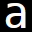

<!--
   Copyright (C) ~2026 Mitsuo Saito

   Created date 2026-09-22 19:52 +0900
   Author: Mitsuo Saito <arch320(AT)gmail(DOT)com>

   $Revision: 59:e1e3a1f097f2 tip $
   $Committer: arch320 $
   $LastModified: Sat, 26 Sep 2026 21:26:18 +0900 $

   $Lastlog: readme.md $
-->

# Gradient Typing Effect

<br />

:sparkles: Leaves a gradient behind the last character you typed.<br/>
:sparkler: Each self-inserted character briefly transitions from the specified color to the topmost foreground color.<br/>
:full_moon_with_face: Naturally smooth, perceptually uniform interpolation using the :art:[CIELAB color space](https://en.wikipedia.org/wiki/CIELAB_color_space)<br/>

Oh sorry. It doesn't have the flashy look of a gaming PC :grin:

Tested on GNU Emacs 32.0.50

## :computer: Installation

### :woman_technologist: Basic

[Grab It](gradient-typing.el).

or

```sh
git clone https://github.com/arch320/gradient-typing.git
```

Then place `gradient-typing.el` in your `load-path`, and byte-compile it.

Lastly edit in your `init.el` file.

```el
(require 'gradient-typing)
(global-gradient-typing-mode t)
```

That's all :thumbsup:

## :notebook_with_decorative_cover: Usage

Just type!

## :gear: Customizable variables

### :small_blue_diamond: gdt-frames - `Delay between gradient frames`

Default value is 0.0625 (16fps)

> [!WARNING]
> Lower values may significantly affect performance.

<br />

### :small_blue_diamond: gdt-pattern - `Number of gradient patterns to be generated`

The larger the pattern, the longer the gradient lasts.

Default value is 8

> [!TIP]
> gradient duration = gdt-frames * gdt-pattern

<br/>

### :small_blue_diamond: gdt-start-color - `Start color of the gradient`

This color transitions into the current context color as a gradient.

<table>
  <tr align="center">
    <td></td>
    <td></td>
    <td></td>
    <td></td>
  </tr>
  <tr align="center">
    <td>white</td>
    <td>red</td>
    <td>yellow</td>
    <td>turquoise</td>
  </tr>
</table>

Default value is "White"

> [!NOTE]
> `gdt-frames` and `gdt-start-color` are watched by variable watcher which
> clears gradient pattern cache and terminates all gradients when these variables are set.

## :new_moon: Known limitation

The foreground color(gradient end-color) is determined immediately after typing.
If the text has not been fontified at that point (maybe due to the jit-lock settings),
the gradient end-color may differ from the color actually displayed.

:memo: File a bug report in [Issues](https://github.com/arch320/gradient-typing/issues).

# :wrestling: Acknowledgment

Special thanks to [Barrulus](https://github.com/barrulus) for the original idea and inspiration.<br/>
This project was heavily inspired by :octocat: [welding-cursor.el](https://github.com/barrulus/forge-cursor/blob/main/welding-cursor.el)

<br/><br/>
`$Id: readme.md,v 59:e1e3a1f097f2 2026-09-26 21:26 +0900 arch320 $`<br/>
`readme.md ends here`
